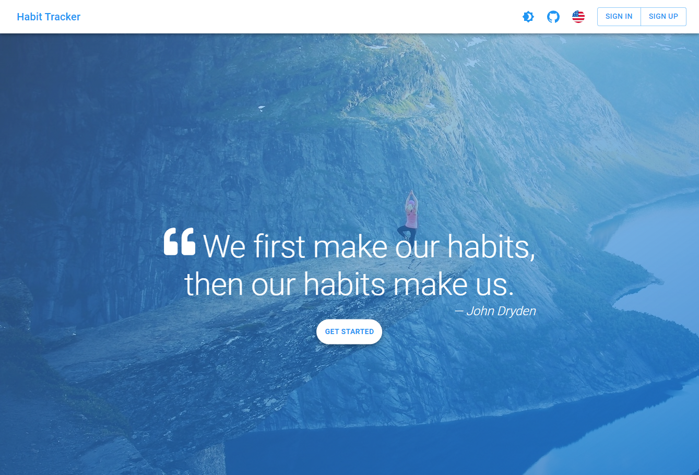
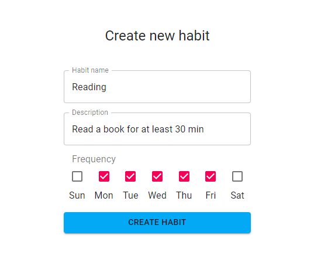

# Tracking Habits Made Easy!

## Table of Contents

- [Introduction](#about)
- [Key Features and Tech](#features-and-stack)
- [Snapshot Gallery](#screenshots)
- [Start Your Journey](#getting-started)
- [Hurdles Faced](#challenges)
- [Powered by Create React App](#bootstrapped-with-create-react-app)

## Introduction

Embark on the journey of mastering habits with **Habit Tracker**, the culmination of my work during [CS50's Introduction to Computer Science Course](https://www.edx.org/course/cs50s-introduction-to-computer-science).

## Key Features and Tech

### Features
- Account creation via email/password
- Authentication through Facebook, GitHub, or Google
- Guest login option available
- Manage habits: add, edit, delete
- Track habits as `completed`, `failed`, or `skipped`
- Visualize weekly performance via bar chart
- Summarized performance for last week, current week, day, and all-time
- App customization with color theme options
- Dark mode toggle available

### Stack

* React
* React Query
* React Router
* React Hook Form
* Material UI
* Firebase
  * Authentication
  * Realtime Database
  
## Snapshot Gallery

- Homepage Preview



- Sign up using **Facebook**, **GitHub**, **Google**, or create a new account.


- Create a new habit effortlessly.



- Manage your habits with ease.


- Dashboard for tracking habit progress.


- Customize the app to suit your preferences.


- Personalize your experience with the perfect theme.


## Start Your Journey

### Clone and Install

```bash
# Clone the repository
git clone https://github.com/anmolranjan1/habit-tracker-app.git

# Install dependencies
cd habit-tracker-app
yarn

### Connect Firebase

1. Login to [Firebase](https://console.firebase.google.com/)
2. Create project
3. Create Realtime Database
   1. In step 2, check “Start in **test mode”**
4. Authentication > Sign-in method > Sign-in providers, and add the following:
   1. Email/Password
   2. Google
   3. Anonymous
   4. (Optional): If you want to add Facebook and/or GitHub, you’ll have to get Client IDs and secrets from these services
5. Go to Project Overview and add a web app
6. You don’t need to run `npm install firebase`, it’s already installed
7. You should see a `firebaseConfig` similar to this:

    ```bash
    const firebaseConfig = {
      apiKey: "<YOUR_API_KEY>",
      authDomain: "<YOUR_AUTH_DOMAIN>",
      databaseURL: "<YOUR_DATABASE_URL>",
      projectId: "<YOUR_PROJECT_ID>",
      storageBucket: "<YOUR_STORAGE_BUCKET>",
      messagingSenderId: "<YOUR_MESSAGING_SENDER_ID>",
      appId: "<YOUR_APP_ID>",
      measurementId: "<YOUR_MEASUREMENT_ID>",
    };
    ```

8. Create `.env.local` file, by duplicating `.env.local.example`, and use config above to fill it out

### Start the app

```bash
# Start development server
yarn start
```
The app should be running at: [http://localhost:3000](http://localhost:3000/)

## Bootstrapped with Create React App

This project was bootstrapped with [Create React App](https://github.com/facebook/create-react-app).